# Ghurtejai

Tour planning and experience sharing app for Bangladesh.

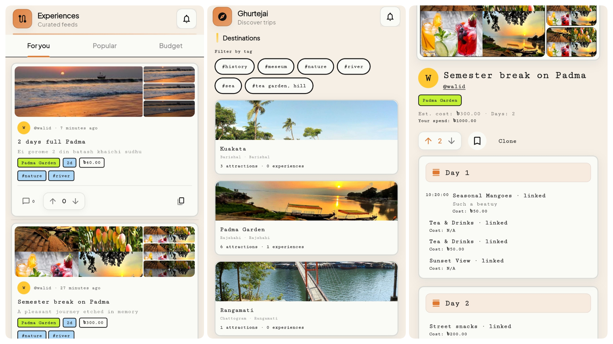

**Stack:** Flutter + Django REST Framework + PostgreSQL + Redis + Celery + Cloudflare R2

## Project Structure

```
ghurtejai/
├── backend/          # Django REST API
│   ├── apps/         # Django apps (accounts, destinations, experiences, etc.)
│   ├── config/       # Settings, URLs, Celery, WSGI
│   ├── core/         # Shared: soft delete, permissions, pagination, throttles
│   └── requirements/ # Python dependencies (base, dev, prod)
├── frontend/         # Flutter mobile app
│   └── lib/
│       ├── app/      # Theme, router
│       ├── core/     # Constants, errors
│       ├── data/     # API client, services
│       ├── features/ # Feature screens (auth, explore, destinations, etc.)
│       └── shared/   # Reusable widgets, providers
├── docker-compose.yml      # Production
├── docker-compose.dev.yml  # Development
└── nginx/                  # Reverse proxy config
```

## Quick Start

### Backend (Docker)

```bash
cp .env.example .env
docker compose -f docker-compose.dev.yml up -d
docker compose -f docker-compose.dev.yml exec web python manage.py migrate
docker compose -f docker-compose.dev.yml exec web python manage.py loaddata divisions_districts
docker compose -f docker-compose.dev.yml exec web python manage.py createsuperuser
```

API available at `http://localhost:8000/api/docs/`

### Backend (Local)

```bash
cd backend
python -m venv .venv && source .venv/bin/activate
pip install -r requirements/dev.txt
# Set up PostgreSQL and Redis, update .env
python manage.py migrate
python manage.py loaddata divisions_districts
python manage.py createsuperuser
python manage.py runserver
```

### Frontend

```bash
cd frontend
flutter pub get
flutter run
```

Update `lib/core/constants.dart` with your API base URL.

## API Endpoints

| Group          | Endpoints                                                    |
|----------------|--------------------------------------------------------------|
| Auth           | `POST /api/auth/register/`, `login/`, `logout/`, `refresh/` |
| Profile        | `GET/PATCH /api/auth/profile/me/`, `GET /api/auth/profile/<username>/` |
| Destinations   | `GET/POST /api/destinations/`, `GET /api/destinations/<slug>/` |
| Attractions    | `GET/POST /api/destinations/attractions/`                    |
| Transport      | `GET/POST /api/destinations/transports/`                     |
| Tags           | `GET/POST /api/tags/`                                        |
| Experiences    | `GET/POST /api/experiences/`, `GET /api/experiences/<slug>/` |
| Clone          | `POST /api/experiences/<slug>/clone/`                        |
| Votes          | `POST /api/interactions/vote/<id>/`                          |
| Comments       | `GET/POST /api/interactions/comments/<id>/`                  |
| Bookmarks      | `POST /api/interactions/bookmarks/destination/<id>/`         |
| Notifications  | `GET /api/notifications/`, `POST .../read-all/`             |
| Search         | `GET /api/search/?q=...&type=all`                           |
| Moderation     | `GET /api/moderation/queue/`, `POST .../experience/<id>/`   |

## User Roles

| Role      | Capabilities                                              |
|-----------|-----------------------------------------------------------|
| Guest     | Browse only, prompted to sign up on interactions          |
| User      | Full: create, share, clone, bookmark, comment, upvote     |
| Moderator | Approve/reject destinations, attractions, experiences     |
| Admin     | All moderator powers + Django Admin access                |

## Screenshots

| | |
|---|---|
| 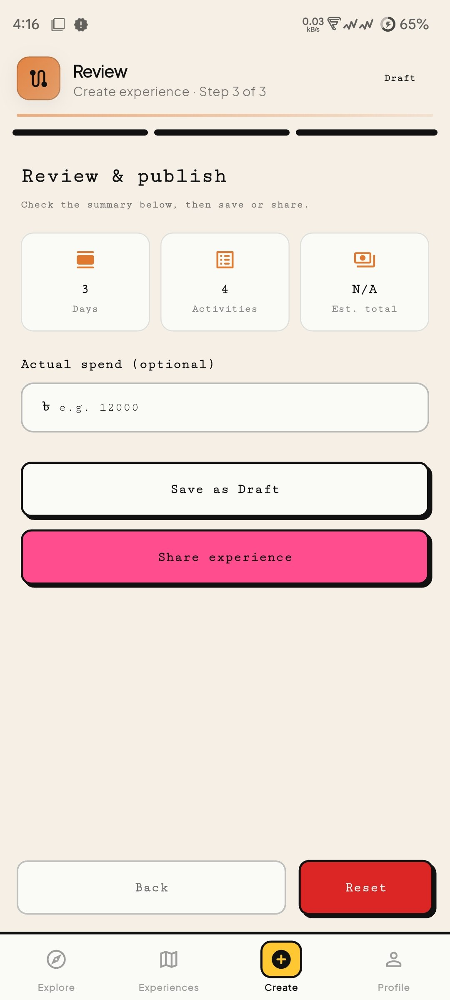 | 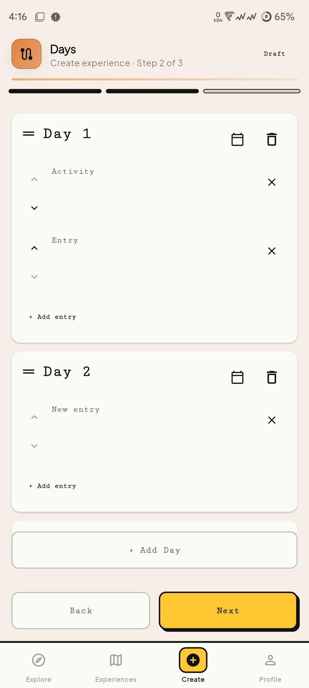 |
| 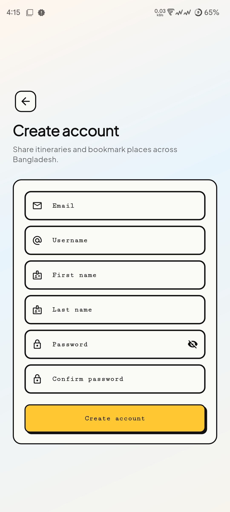 | 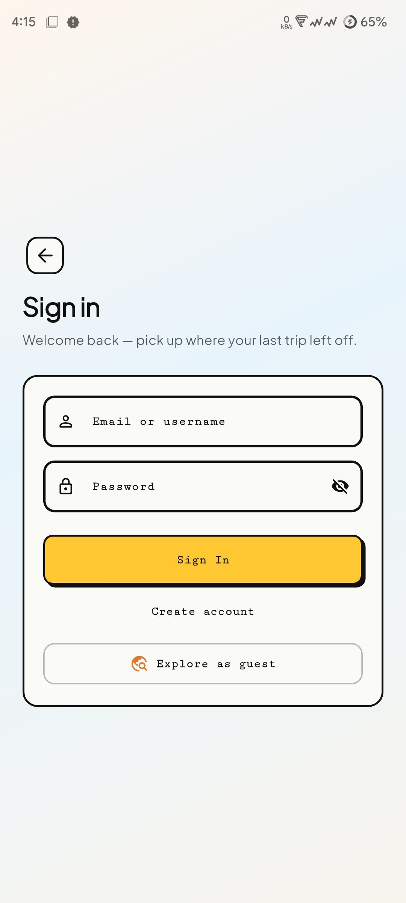 |
| 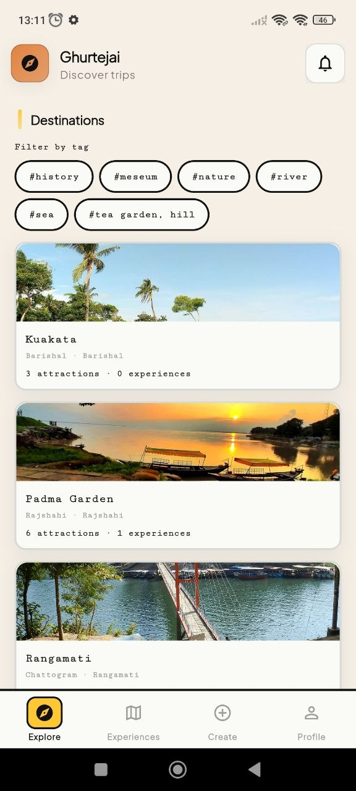 | 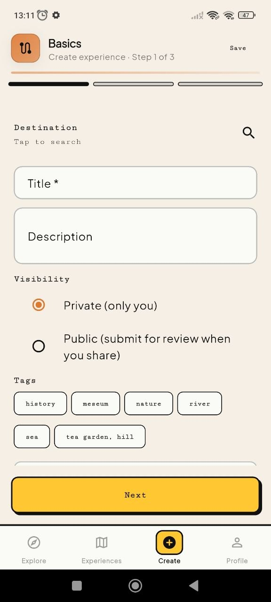 |
| 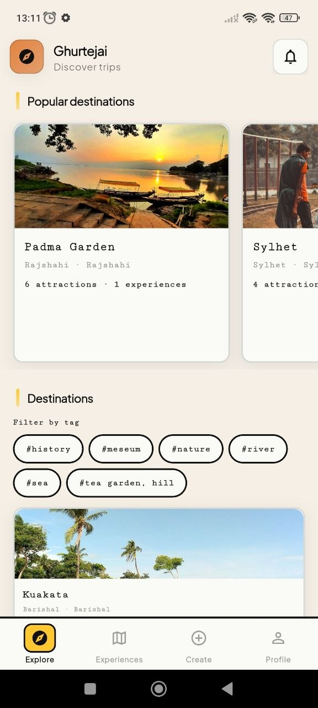 | 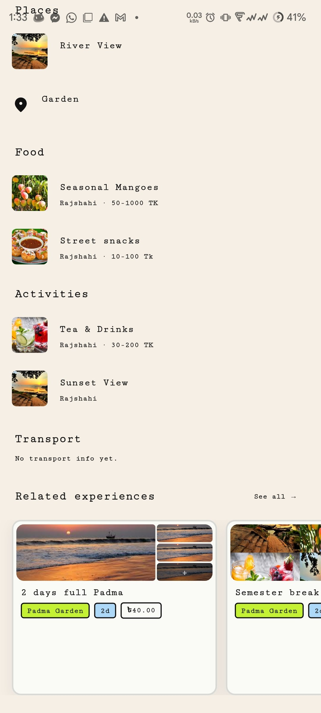 |
| 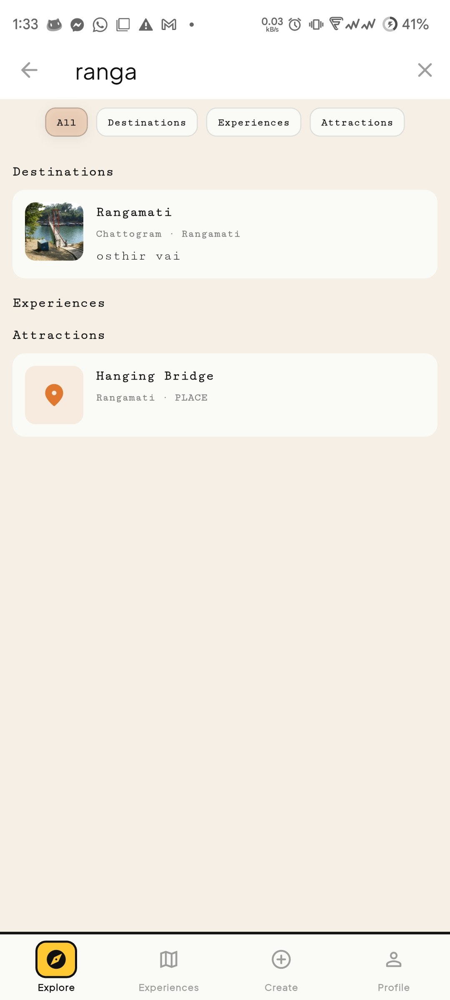 | 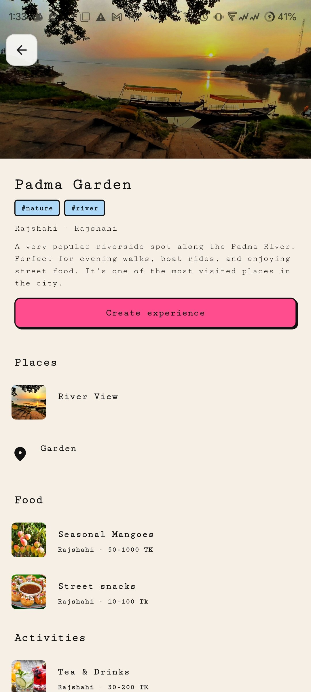 |
| 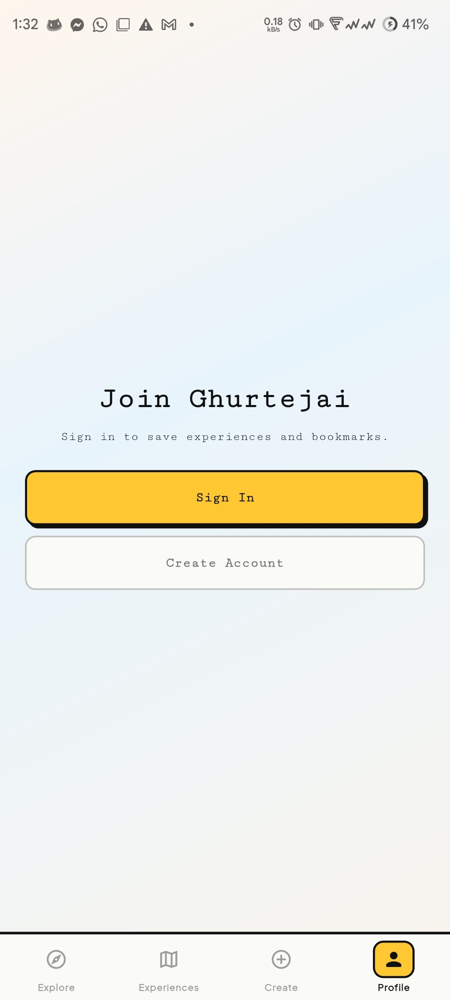 | 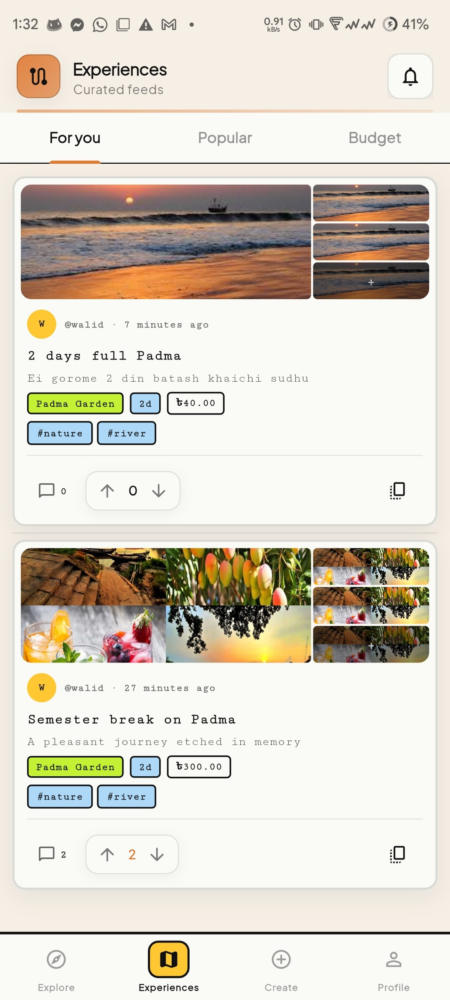 |
| 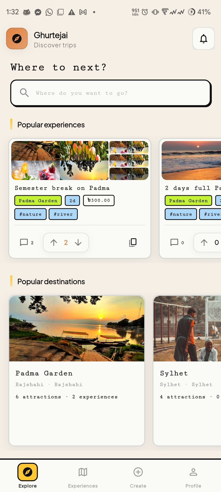 | 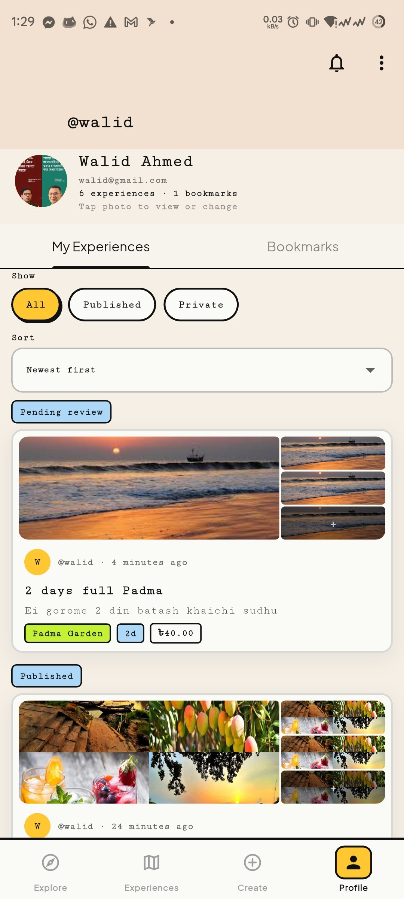 |
| 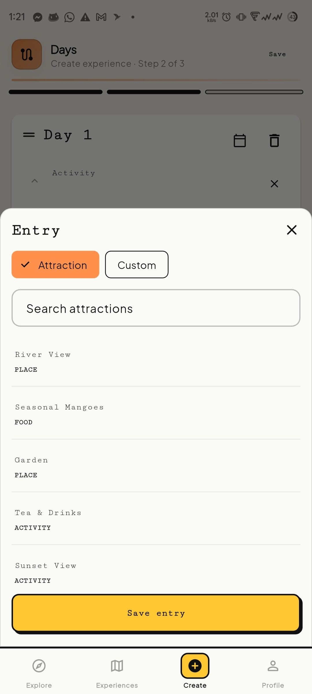 | 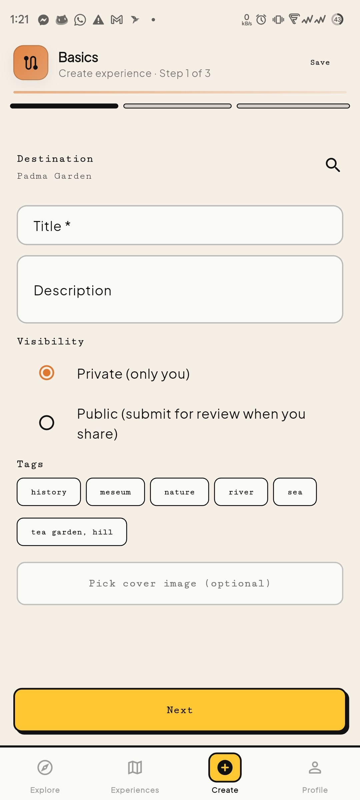 |
| 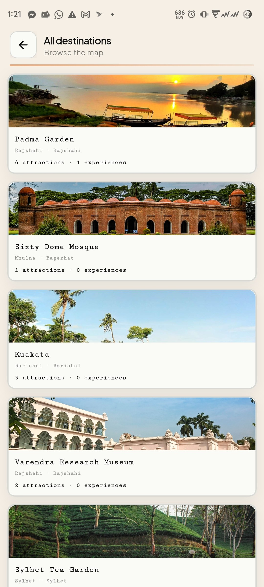 | 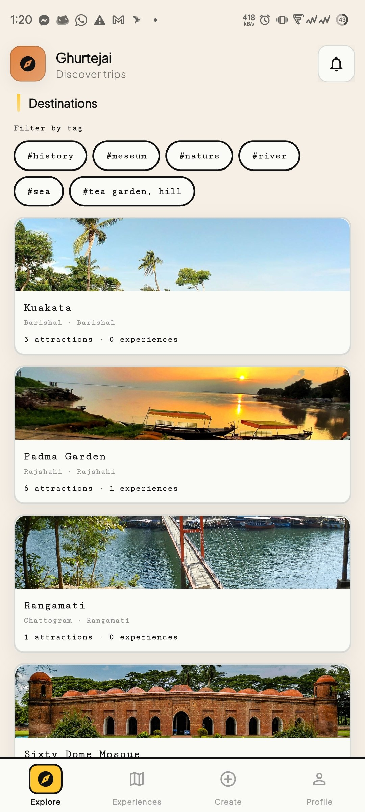 |
| 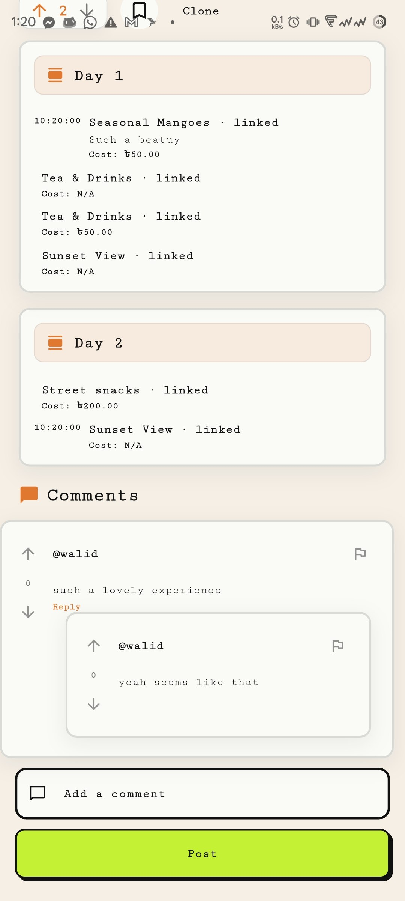 | 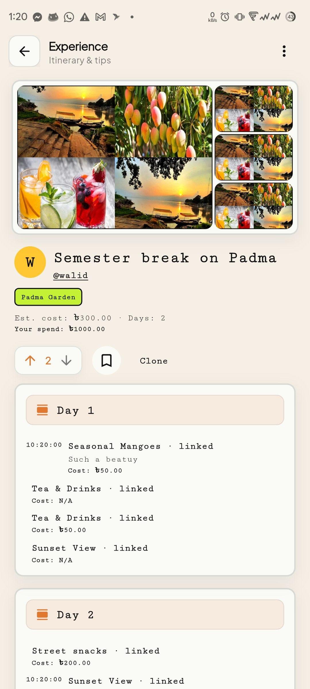 |

## License

GNU General Public License v3.0
